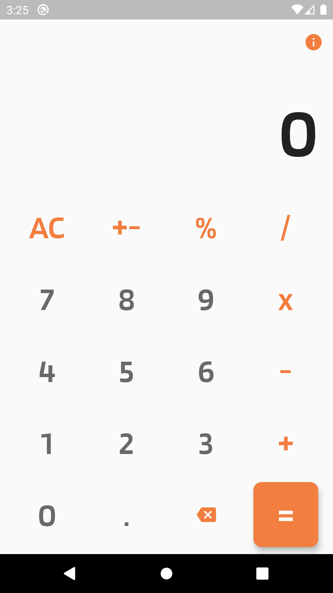
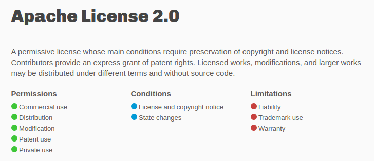

# Cal C

A cross platform app to calculate in a modern designed calculator.

### Tech

Cal C uses a number of tech to work properly:

* [FLUTTER] - Google’s UI toolkit for building beautiful, natively compiled applications.

And of course Cal C is open source with a public repository on GitHub.

## Download

| Version | Android | iOS |
| --- | --- | --- |
| 1.0.0 | [APK][1] | IPA |

### Screenshots
----

### Development

Want to contribute? Great! :heart:

Fork the repo make changes and make pull requests.

### Todos

 - Make a option to do more arethmetic things.
 - Add a history of calculations.

License
----

Apache License 2.0

**Free Software, Hell Yeah!**

[//]: #DownloadLinks
[1]: https://github.com/i-am-ahad/Cal_C/releases/download/v1.0.0/cal-c.apk
